# git-scripts

Git utility scripts

_Created by [@piecioshka](https://twitter.com/piecioshka)_

## Installation

```bash
cd ~/projects/ # or any workspace what you use
git clone git@github.com:piecioshka/git-scripts.git

# Bash: please add to `~/.bash_profile`
export PATH="$HOME/projects/git-scripts/:$PATH"

# Fish: please add to `~/.config/fish/config.fish`
set -gx PATH $HOME/projects/git-scripts/ $PATH
```

**TIP**: When you modify shell configs, please restart the terminal to apply new settings.

## Commands

* `git bars COMMITTER_AUTHOR YEAR[_MONTH]` — Display revisions count in the past period

  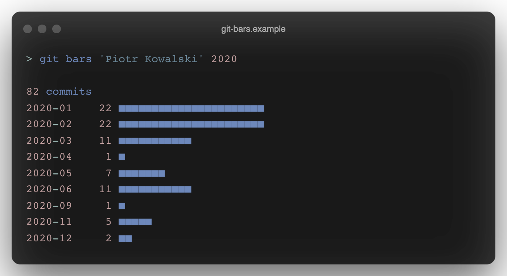

* `git changed-packages [--oneline] [--main]` — Display names of packages with changed files

  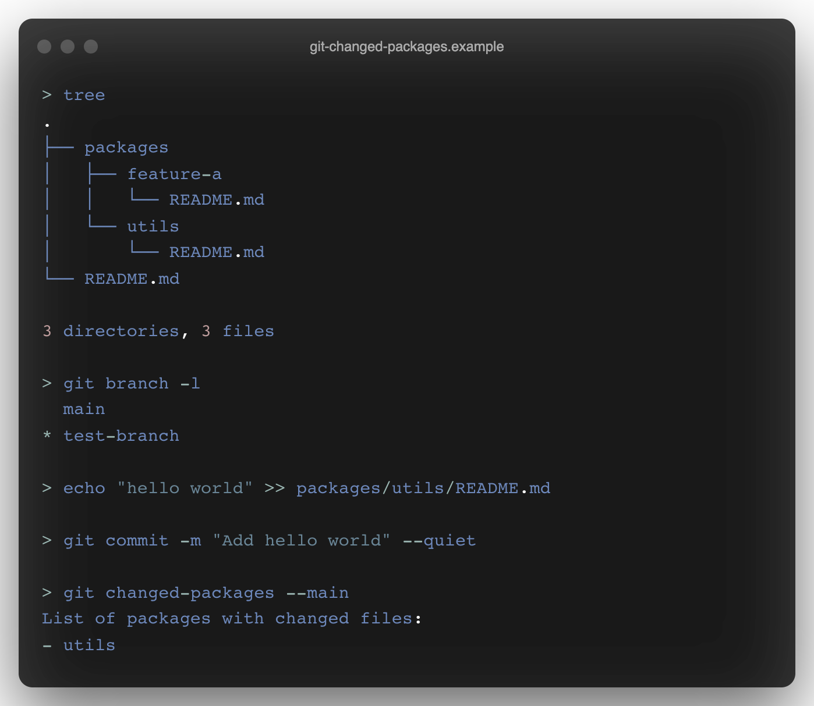

* `git fire [MSG]` — Create commit with all changes and push to the origin

  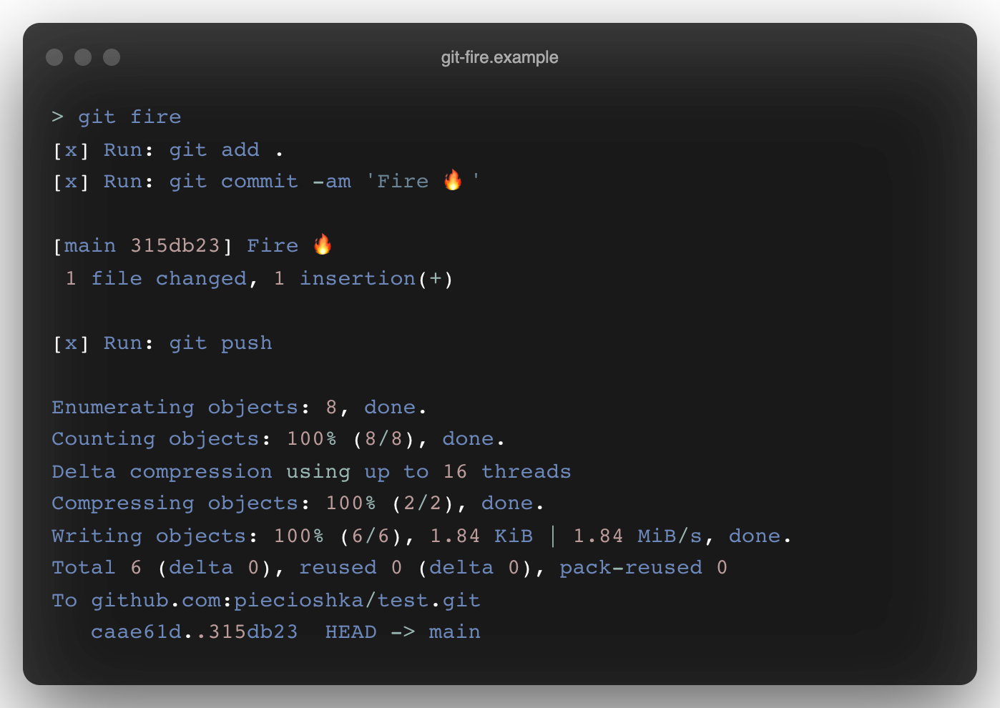

* `git projects-births [WORKSPACE_PATH=.]` — Display when projects start for the whole workspace

  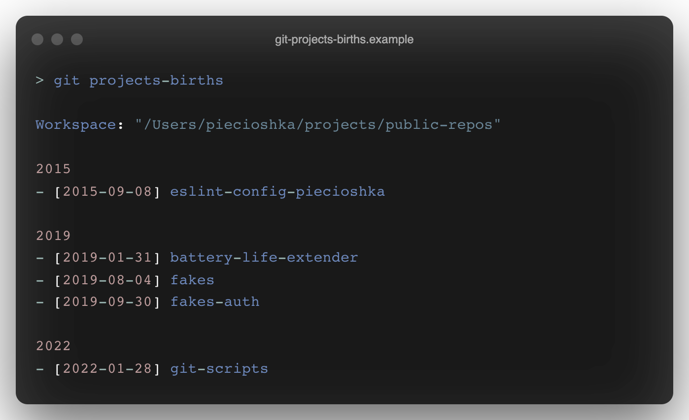

* `git projects-status [WORKSPACE_PATH=.]` — Display status for all projects in a workspace

  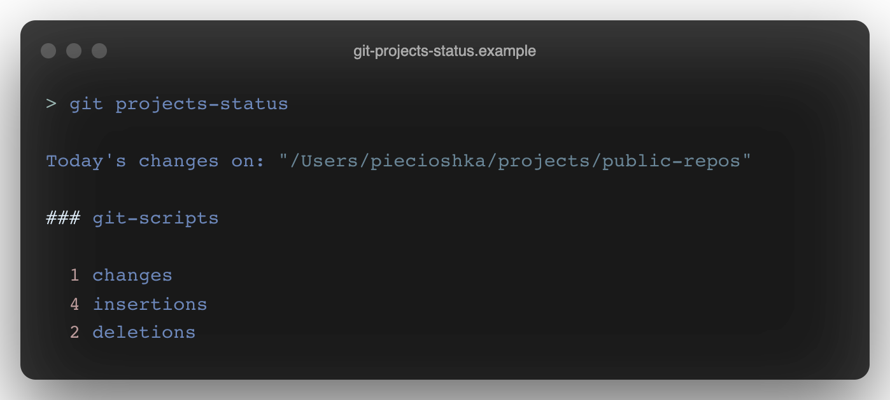

* `git projects-update [WORKSPACE_PATH=.]` — Update all projects in a workspace

  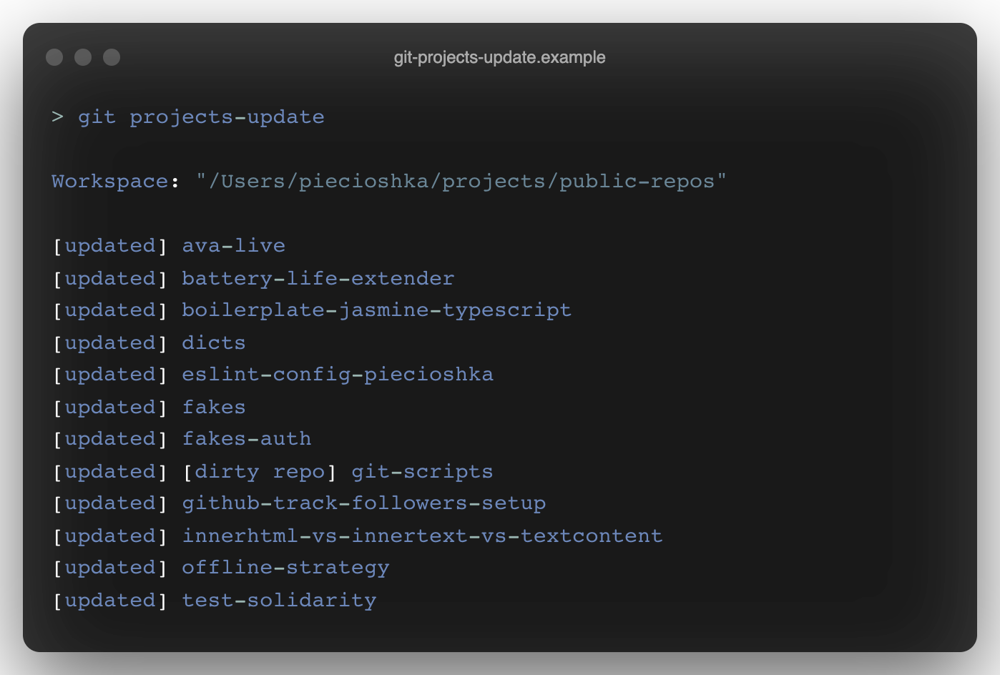

* `git run-on-nested-repos` — Run command in all nested repositories

  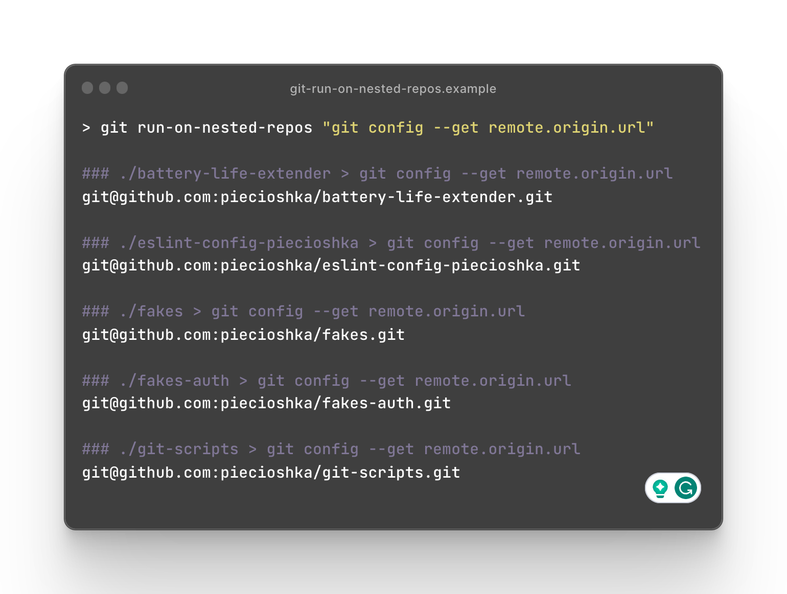

* `git save` — Create revision with a dummy commit message

  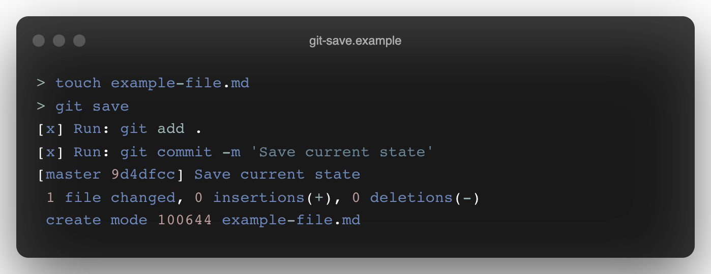

* `git setup` — Init repository and create initial revision

  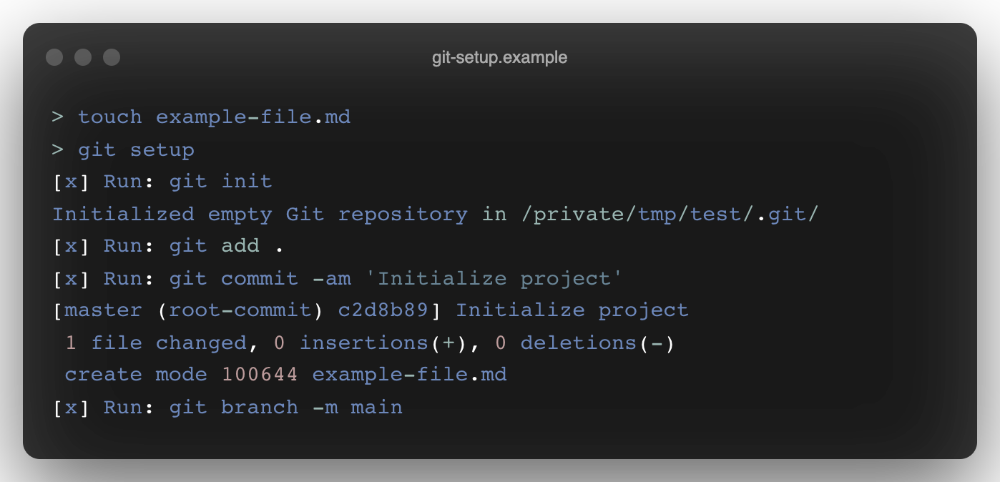

* `git squash-all-commits` — Remove `.git/` directory and setup initialize repo again

  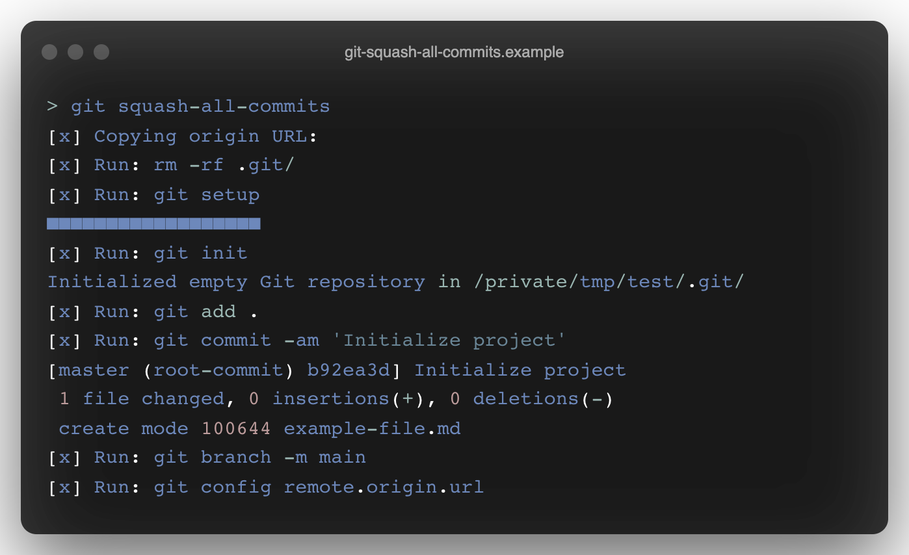

* `git sync` — Check if local nad remote repo states are the same

  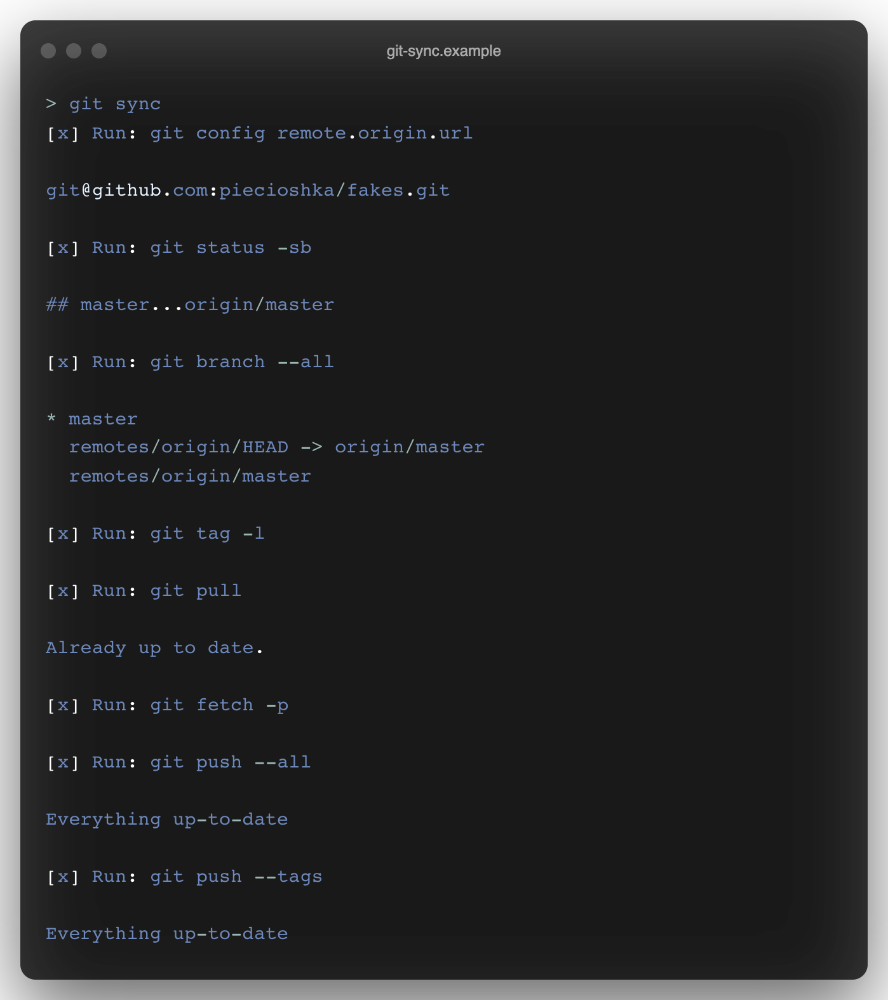

* `git user` — Display current user

  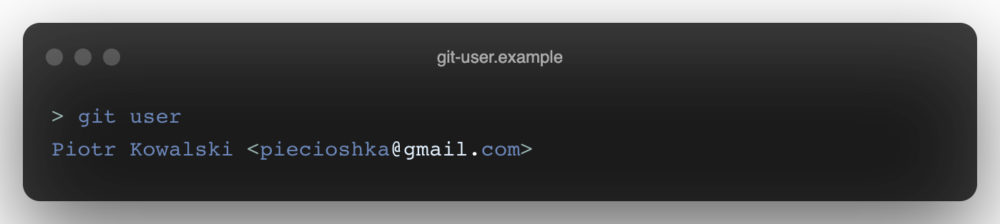

* `git zip PACKAGE_NAME` — Extract archive from the current repository

  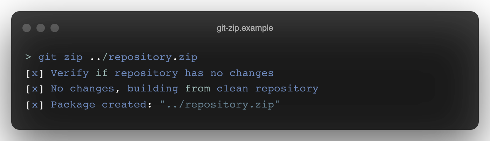

## Related

* https://github.com/ddollar/git-utils
* https://github.com/jwiegley/git-scripts
* https://github.com/knadh/git-bars
* https://github.com/nvie/gitflow

## Screenshots 📸

To make a screenshots I used https://ray.so/ _(use Bash theme, without background)_
